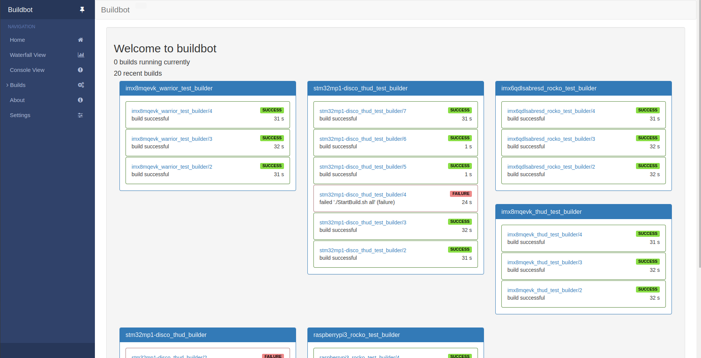

# fmu-automation-build

This project allows to automate builds for fullmetalupdate. Each time there is a change in a branch the repository https://github.com/FullMetalUpdate/meta-fullmetalupdate-extra, a build will be triggered for all machines which depend of this branch.

This project is using buildbot, running in docker containers. For more documentation about buildbot go to https://docs.buildbot.net/current/tutorial/docker.html.

This project has only been tested on Linux.

## Prerequisites

You must have install all dependencies of FullMetalUpdate. To see all dependancies have a look at https://www.fullmetalupdate.io/docs/documentation/.

You have also to additionnaly install docker-compose:

```sh
pip install docker-compose
```

Test if docker is running:

```sh
sudo docker run -i busybox /bin/echo Success
```

## Usage

### Start the FMU cloud server

You first have to start the FMU cloud server. This server has to be running because all builds performed with FMU need to push them to the cloud server. 

The start the cloud server please read the "Set up the server" section on the documentation of fullmetalupdate on https://www.fullmetalupdate.io/docs/documentation/.

### Set up buildbot

In a working directory, use git to download the project

```sh
$ git clone https://github.com/lquinet/fmu-automation-build.git
$ cd fmu-automation-build
```

Before launching buildbot you have to configure the variables in the [.env](docker/master/.env) file:

* **BUILDBOT_WORKER_WORKDIR** : working directory of the worker. It will store all build files in that directory 
* **FMU_CLOUD_HOSTNAME** : hostname of FMU cloud server. If you launched it on you local machine you can get it thanks to the `hostname`command.
* **GITHUB_TOKEN** : GitHub API token to push build status to the repository.

Once you have done it, you can launch buildbot:

```sh
$ cd docker
$ docker-compose up
```
You should now be able to go to http://localhost:8010, where you will see a web page similar to:



## Customisation

### master.cfg

If you want to customise the behavior of buildbot, you have to modify the [master.cfg](master.cfg) file.

In this file you can modify workers behavior, changes sources, schedulers, builders, and so on.

There are some custom variables:

* **REPO_URL**: URL of the repository to track for changes.
* **BRANCH_MACHINE_PAIRS**: Defines the branches of *REPO_URL* to track and the dependant machines.
* **YOCTO_REPO_URL**: URL of the local server repository of FMU.

```python
REPO_URL="https://github.com/lquinet/meta-fullmetalupdate-extra.git"
SUPPORTED_MACHINES_ROCKO=["imx6qdlsabresd", "raspberrypi3"]
SUPPORTED_MACHINES_THUD=["imx8mqevk", "stm32mp1-disco"]
SUPPORTED_MACHINES_WARRIOR=["imx8mqevk"]
BRANCH_MACHINE_PAIRS = {
    "rocko" : SUPPORTED_MACHINES_ROCKO,
    "thud" : SUPPORTED_MACHINES_THUD,
    "warrior" : SUPPORTED_MACHINES_WARRIOR,
}
YOCTO_REPO_URL="https://github.com/lquinet/fullmetalupdate-yocto-demo.git"
```

### docker-compose.yml and .env

You can also change other parameters in this file such as BUILDBOT_WEB_PORT (port of web page), BUILDBOT_WORKER_PORT, etc.

The [docker-compose.yml](docker/master/docker-compose.yml) file depends on the [.env](docker/master/.env) file.

## Improvements

* **Deploy** : Automate SD card image flashing as soon as a new image is builded
* **Track other repositories** than https://github.com/FullMetalUpdate/meta-fullmetalupdate-extra. Typically all repositories defined by the manifests in https://github.com/FullMetalUpdate/manifest. This implies to add more change sources (one for each repo) and schedulers (one for each branch)
* **Setup reporters**: build status on GitHub, a mail notifier, an IRC notifier, ...
* **Test**: test if the build is running properly on the target